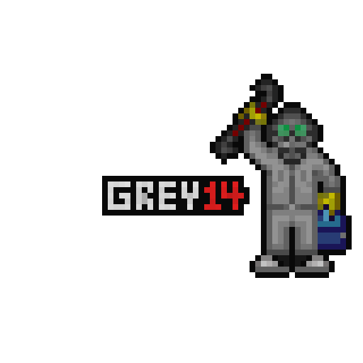

 

<table>
  <tr>
    <th>Server uptime:</th>
    <td></td>
  </tr>
</table>

_SandwichStation_ was a fork of _ShibaStation_†, which is a fork of _Goob-Station_, which is itself a fork of _Space Station 14_. This fork is mainly customized to our own standards and balances.

## Links

## Contributing

We are happy to accept contributions from anybody. Get in [SandwichStation Discord](https://discord.gg/Z6JvtKw6tp) if you want to help but you dont know how to. Feel free to check the [list of issues](https://github.com/SandwichStation/SandwichStation/issues) that need to be done and anybody can pick them up. Don't be afraid to ask for help either!
While _SandwichStation_ doesn't use the [contribution guidelines,](https://docs.spacestation14.com/en/general-development/codebase-info/pull-request-guidelines.html) you can always check the documentation to help you out.

## Building

Please check our [Documentation](https://docs.sandwich14.com/en/general-development/setup.html) for steps on how to build your own version.

[More detailed instructions on building the project.](https://docs.sandwich14.com/en/general-development/setup.html)

## License
[You can find our license on the license tab above](https://github.com/SandwichStation/SandwichStation?tab=License-1-ov-file)
